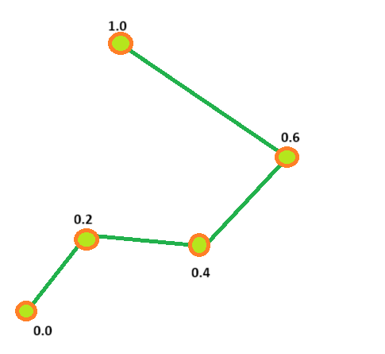
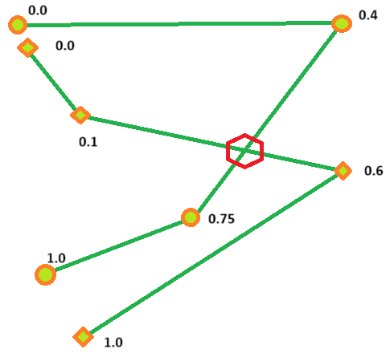

# Efficient geometrical library

This is the library of geometrical algorithms implemented to be fast and consume low memory. Here you wil find:

- intersections: poly-line to poly-line, poly-line to AABB, poly-line to Morton's grid
- projections: point to poly-line, points to poly lines.
- matching: poly-lines to poly-lines
- r-tree
- geometry simplification
- tiling: NDS/HERE
- basic algorithms in Euclidean and geodetic spaces
- range operations
- basic vector operations

## Basic

This library is a bit different to other geometrical library like JTS, this library  is working with a parametric geometry.
First of all, “geometry” in this library means sequence of points and that sequence can be interpreted as a polyline or
a ring.  A vertex (a shape point) of that geometry, additionally to regular coordinates x, y and z has a parametric offset.
This offset represents normalized travel distance along geometry from first vertex to that specific vertex.
The distance normalized in relative way form 0.0 to 1.0, where 0.0 is first vertex and 1.0 is the last vertex of the geometry.


How you compute a distance between two positions, the library (in general) does not care , but it provides geodetic length calculator for your.

```java
    double length = Geodetic.calcDistanceInMeters(v1 , v2);
```

There are two basic classes to start: a V4d and a G4d. The V4d is a trivial vertex with additional property - offset:

````java
public class V4d implements Comparable<V4d>
{
  // all properties are public due best performance
  public final double xLon;
  public final double yLat;
  public final double zAlt;
  public final double o; // parametric offset along specific shape
````

The G4d is a geometry (polyline or ring) with of course array of vertices representing the shape,but additionally that
shape has breakout on [monotonic segments](docs/msegment.md) and can be parametrized by customer specific payload
associated with the geometry.

```java
/**
 * represents any non point geometry. dependently on context it can be a poly-line or interior/exterior ring of a polygon
 */
public class G4d<TCustom> extends AABB
{

  final double length;   // absolute length of the feature
  final V4d[] shape;    // geometrical shape of the feature
  final Edge[] edges;    // edges of the feature's shape
  final MSegment[] segments; // monotonic segments of the feature's shape
  final TCustom customData; // custom data
```

The G4d does not have public constructor to create an instance, instead there are two static “build” methods you may use.
First to build instance direct from V4d array and length of the feature, second using adapter to convert your geometry type
to V4d array and length of the feature.

```java
  /**
   * build g4d from prepared v4d array and custom data
   * @param _length length of the feature
   * @param _shape prepared v4d array
   * @return g4d feature
   */
  public static <T> G4d<T> build(final double _length, final V4d[] _shape, final T _custom_data)
  ...
  /**
   * build g4d from custom feature using specific adapter
   *
   * @param _adapter     adapter to convert
   * @param _custom_geom custom feature
   * @param <TGeom>      custom feature's type
   * @return g4d feature
   */
  public static <TGeom, TData> G4d<TData> build(final InputAdapter<TGeom> _adapter, final TGeom _custom_geom, final TData _custom_data)
  ...
  public interface InputAdapter<TCustomGeometry>
  {
    AnAssociation<V4d[], Double> convert(final TCustomGeometry _geometry);
  }
```

I recommend to implement an adapter for your geometry type as a singleton and use it in any place. The library provide
adapters to convert geometry given as ArrayList<double[]> (cartesian or wgs) and two helpers `convertFromLINESTRING`
and `convertFromMULTILINESTRING`.

If you start to implement your adapter take in account that calculation of the parametric offset for each vertex as well
as computation of the feature length is fully on your side.

## Offsets and ranges

Let's talk what an offset along geometry can give you. First of all it can be used as a markup element to point specific location on a feature.
For example, there are two geometrical features crossing each other in specific point.The corresponded intersection offset
is individual for each geometry.



For one feature it is 0.4, for other it is 0.6. Having that individual location you may easily
split each feature on intersection point.

```java
  void func(final G4d<?> _first_feature, final G4d<?> _second_feature)
  {
    AlgEcl.findIntersections(_first_feature,_second_feature).forEach(intersection -> {
      V4d first_feature_intersection = intersection.a;
      V4d second_feature_intersection = intersection.b;
      G4d<?> [] two_parts_of_first_feature = _first_feature.split(first_feature_intersection.o);
      G4d<?> [] two_parts_of_second_feature = _first_feature.split(second_feature_intersection.o);
    
      // continue hard work
    });
  }
```

But keep in mind, that having the split position in hands, you probably do not need to materialize it imitatively, because
to address a specific part you may use a range `[0, split_offset]`or `[spit_offset, 1]`.
Two offsets describes a range along specific feature which you can use to associate part of a feature with you attributes
or manipulate it as a reference. For example a geometrical match between two features can be described as two associated ranges
on first and second features.

```java
/**
* a range to range base reference on parameterized custom type T
* @param <T>  custom type which is referenced
*/
public class RangeReference<T> 
{
  public final Range range;  // the range on feature which is owning the RangeReference object
  public final T target;     // target object which is referencing
  public Range targetRange;  // the range on target object
  public boolean fromMinToMax; // direction of target range
```

So, offsets and ranges are working as a marking along feature. And that is the [link if you want to go deeper](docs/offsets.md).

## Geometrical matching:

The `PolyLineBasicMatcher` class is doing geometrical match for you. Let's assume you have a reference scope A as collection
of `G4d` geometries. Then you shall build matcher using that static method:

```java
public static <TCustom extends Comparable<TCustom>> PolyLineBasicMatcher<TCustom> buildDefault(final Collection<G4d<TCustom>> _scope,
      final MatchCoreConfig _cfg);
```

Take in account that custom clas you use to parametrize G4d must implement `Comparable` interface. For simplification let's take `TCustom` as
`String`, than:

```java
  public static void doMatch(final Collection<G4d<String>> _reference_scope)
  {
    PolyLineBasicMatcher<String> matcher = PolyLineBasicMatcher.buildDefault(_reference_scope, MatchCoreConfig.STD);
    //... do hard work
  
  }
```

Now you may match any other scope against reference using that matcher. Just simply write something like that:

```java
  public static void doMatch(
                              final Collection<G4d<String>> _reference_scope, 
                              final TreeMap<String,Collection<G4d<String>>> _scopes_to_match)
  {
    // build reference matcher
    PolyLineBasicMatcher<String> matcher = PolyLineBasicMatcher.buildDefault(_reference_scope, MatchCoreConfig.STD);
    _scopes_to_match.forEach((name_of_scope,scope) -> { // take next scope to match
      matcher.match(scope).forEach( pair -> { // going through matched pairs 
        G4d<String> feature_from_scope = pair.a;
        System.out.println("feature " + feature_from_scope.getCustomData() + " from scope " + name_of_scope + " has matches:");
        pair.b.forEach(reference -> { // report each matched range
          G4d<String> reference_feature = reference.target;
          String match_direction = reference.fromMinToMax ? "same direction" : "opposite direction";
          System.out.println("\t" + reference.range + " to " + reference.targetRange + " " + match_direction 
            + " on reference feature " + reference_feature.getCustomData());
        });
      });
    });
  }
```

The `PolyLineBasicMatcher` 🚀️ works very very fast,I'm sure you won't have to optimize it 😄. And by the way, if you have 
some point positions to match on a G4d scope, the `PolyLineBasicMatcher` helps you as well. Just use 
```java
  public static void doMatch(
                              final Collection<G4d<String>> _reference_scope,
                              final TreeMap<V4d,String> _point_label, // point and label pairs
                              final double _x_lon_tolerance, // bounding box to restrict matching space
                              final double _y_lat_tolerance )
  {
    // build reference matcher
    PolyLineBasicMatcher<String> matcher = PolyLineBasicMatcher.buildDefault(_reference_scope, MatchCoreConfig.STD);
        matcher.findProjections(_point_label,_x_lon_tolerance,_y_lat_tolerance).forEach((label,pair) -> {
      // instead String label you may use own type, but it must implement Comparable
      System.out.println("point " + pair.getThePoint() + " with label " + label + " has projections:");
      pair.getProjections().forEach(projection -> {
        System.out.println("\t projection " + projection.a + " on reference feature " + projection.b.getCustomData());
      });
    });
  }
```

