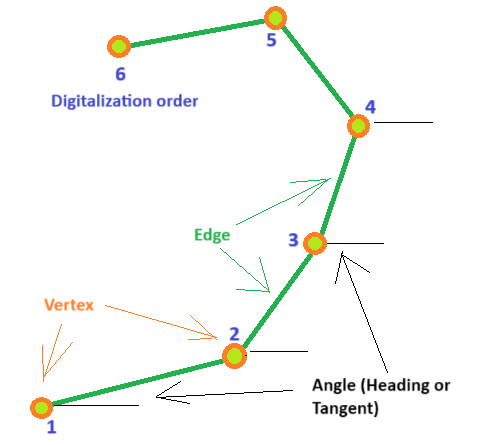
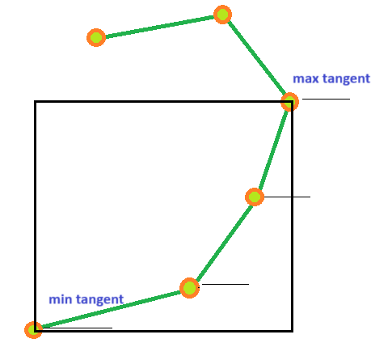
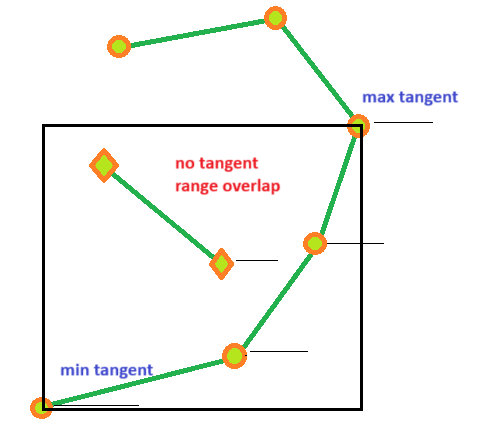

## Monotonic segments

First let's talk about basic geometrical elements. Look on the picture:   



There are:
- Vertex - shape point
- Edge - a straight line connects two vertexes
- Digitalization order - native order of vertexes in a shape
- Heading - an angle of an edge in digitaliztaion order from 0 to 360 grad
- Tangent - an angle of an edge from -Pi/2 to Pi/2

Heading and tangent both are angle characteristic, but tangent is irrelevant to direction - from start to end or from 
end to start, tangent remain the same. Look on the picture above again, the tangent on edges 1 -> 2, 2 -> 3, 3 -> 4 
constantly grows. That constant changing makes monotonic sequence, and edges in that sequence makes monotonic segment. 
There are three kind of monotonic segments possible:        

```java
 enum TangentOrder
  {
    Stable,
    Ascending,
    Descending
  }
```
Let's surround a monotonic segment by AABB - Axis-Aligned Bounding Box



First of all you see that monotonic segment, dependently on order, always started and ended in specific corners of AABB. 
Beside that minimal and maximal tangents having edges, connected to the corners of AABBB. And at last, to the standard AABB
ranges [x-min, x-max] and [y-min, y-max], we have one more: [tangent-min, tangent-max]

That three properties highly useful in different algorithms, for example geometrical match will prove tangent range 
overlap for matching candidates together with AABB overlap.   



