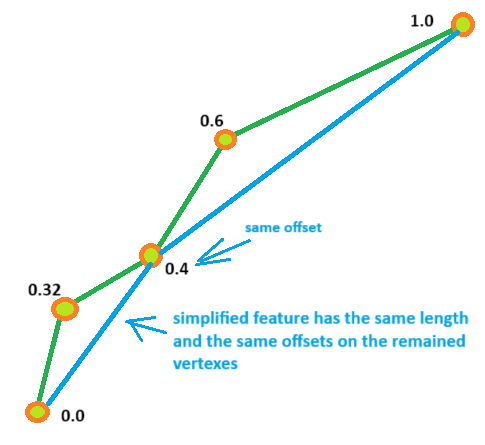
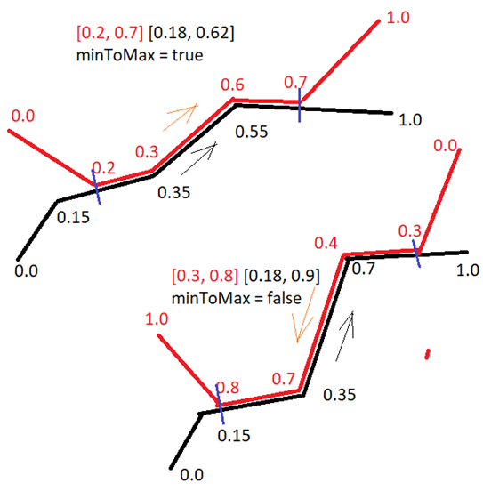
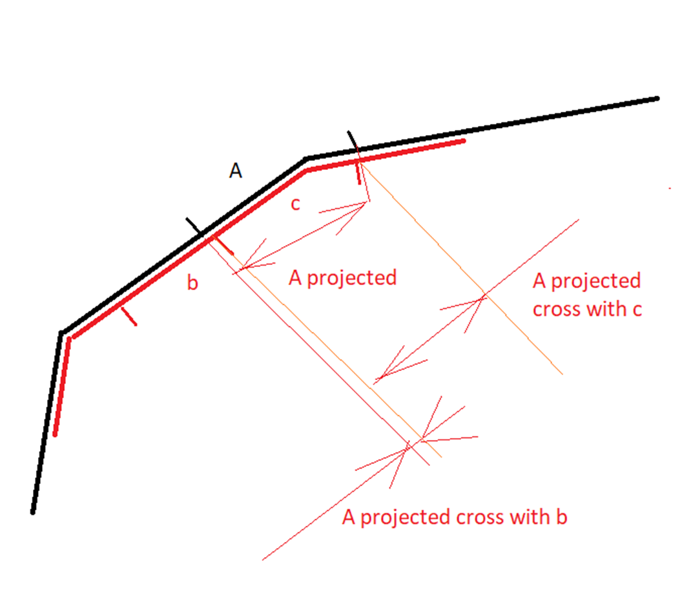

# Offsets and Ranges

Being floating point value, parametric offsets and ranges always shall be processed with specific tolerance.
Don't be tempted to use a “default” constant tolerance here. Since any offset is connected to a feature’s length,
this is basically wrong. Tolerance 0.001 for a feature 10 meters long means 1 centimeter, but for 1 kilometer feature
it is 1 meter already. In a right way you have to specify absolute tolerance as a distance, 0.5 meter for example, and
calculate parametric tolerance for each feature individually using “absolute2parametric” method.

```java
public void someFunc(final double _tolerance_in_meter, final Geom4d<?> _feature)
{
  double parametric_tolerance = _feature.absolute2parametric(_tolerance_in_meter);
  // do hard job...
}
```

This tolerance may be used for specific feature only. But what we shall do when parametric aspects of two or more features
must be compared?

Let’s start from beginning 😄...

A parametric geometry has parametric offset in each vertex, that defines ***parametric metric space*** (or simply **parametric space**) for a feature.
An offset on feature’s edge must be linear interpolated. Any geometry degradation, like simplification or snapping, shall keep parametric
space untouched (*as well as length of the feature*) to have the same distance density as original geometry.



The same distance density means that you drive 1 kilometer in 10 minutes along original *or* simplified geometry. More correct
would be to say “distance density distribution” but we all understand why linear interpolation allow to be used along one edge only 😉
I mean that you are not allowed to interpolate position along whole feature. First you shall find the edge which contains specific offset
and only on that edge you may use linear interpolation to find the position. That is because each edge has individual parametric space.

Let’s say it in other words. Why "parametric" offset? Because length plays a “parameter" role to an offset to calculate physical
property of a feature. For example a bridge with range [min, max] shall have the same physical length on any simplification level of
the feature, even on straight line. That is why once calculated, length and offsets became constant forever.

Okay, so far each geometry has its own parametric space, to work with several geometries together we shall convert
(or “project” in other words) theirs spaces into to a one chosen. Which one shall be chosen is less important, the main
thing is that it fully covers “zone-of-interests” we are investigating. Let’s look an example there ***two features has shared part*** of geometry:



As you see there are two cases possible: or that two features having the same digitalization order on the shared part,
or the order of one feature is going in opposite to others.  Now, to re-project a specific offset inside shared geometry
from one parametric space to others you can use method `RangeReference.Range.reProjectFromPassedRange()` see the implementation:

```java
/**
 * recalculate passed offset in passed other range to corresponded offset in the current range
 * @param _o other offset
 * @param _r other range
 * @param _same_direction do other range and the range having same direction
 * @return corresponded offset in that range
 */
public double reProjectFromPassedRange(final double _o, final Range _r, boolean _same_direction)
{
  double factor = size() / _r.size();
  double ret = _same_direction ? minOffset + (_o - _r.minOffset) * factor : maxOffset - (_o - _r.minOffset) * factor;
  return ret;
}
```

So, looking on picture above, to get offset along black feature from offset along red, you shall call:

```java
double black_offset = black_range.reProjectFromPassedRange(red_offset, red_range, is_red_range_has_same_direction_as_black);
```

Relation like on picture above is covering by the `RangeReference` class

```java
/**
* a range to range base reference on parameterized custom type T
* @param <T> custom type which is referenced
*/
public class RangeReference<T>
{
  public final Range range; // the range on feature which is owns the RangeReference object
  public final T target; // target object which is referenced
  public Range targetRange; // the range on target object
  public boolean fromMinToMax; // direction of target range

```

This class has two methods to simply convert offsets from one space to other:

```java
public double target2parent(final double _target_space_offset);
public double parent2target(final double _parent_space_offset);
```

To convert tolerance from one space ‘a’ to other space ‘b’ you shall multiply space ’a’ tolerance on the factor
range_b.size()/range_a.size(), where range_a and range_b must have the same absolute length (ranges of shared geometry for example)

Good 😄, now we are ready to compare somthing along shared ranges (to verify distribution of attributes for example). I 
recommend to use ***overlap factor*** as the most suitable method there. One of the advantage of that method is that it 
does not require parametric tolerance. But most important thing which is often may be forgotten is 
that **both ranges must be in the same parametric space**. So how the methods works, lets look on the picture:



The range 'A' on the black feature must be projected on red feature first, in that way we get 'A projected'. Now we shall 
calculate range's cross (overlap) of the 'A projected' range with the ranges 'b' and 'c'. Good, finally we may calculate 
overlap factors for each ('b' and 'c')  ranges as `b_cross.size()/b.size()` and `c_cross.size()/c.size()`.  Or *parent* 
overlap factor as `b_cross.size()/A_projected.size()` and `c_cross.size()/A_projected.size()`
If the overlap factor is bigger than some threshold (0.95 for example)  then that range is matched. 
See methods of `RangeReference.Range` class
```java
/**
 * calculate overlap factor of the range with other range
 * @param _r other range
 * @return overlap factor
 */
public double calcOverlapFactor(final Range _r)
{
  return calcCross(_r).size() / _r.size();
}

/**
 * check is the other range may be counted as match based overlap factor threshold
 * @param _r range to match
 * @param overlapThreshold overlap factor match threshold
 * @return true if two ranges are matched
 */
public boolean isMatchedByOverlapFactor(final Range _r, final double overlapThreshold)
{
  return calcOverlapFactor(_r) >= overlapThreshold;
}
```

At the end, I want to say again that offsets and ranges play a "markup of a geometric feature" role.
Offsets and ranges can be manipulated in the abstract way, without being materialized for as long as you like. 
But when you decide, there are three basic materialization methods of the G4d:
```java
V4d calculatePoint(final double _offset, final double _tolerance);
G4d<TCustom> extract(final double _o1, final double _o2, final double _tolerance);
G4d<TCustom>[] split(final double _o);
```


